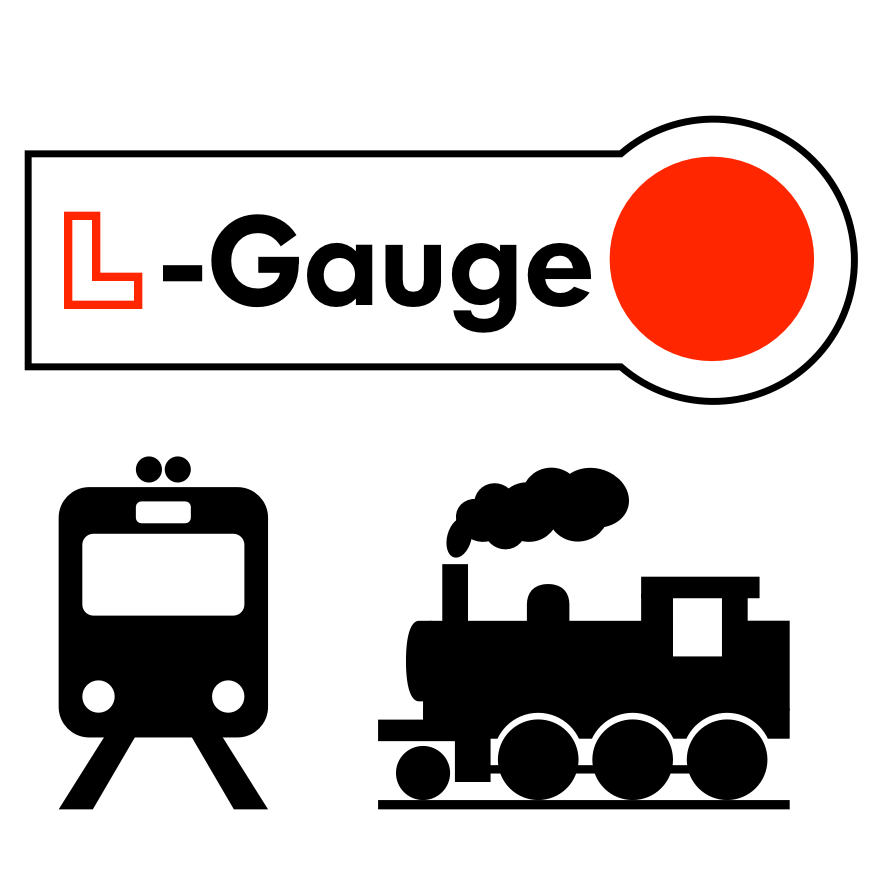
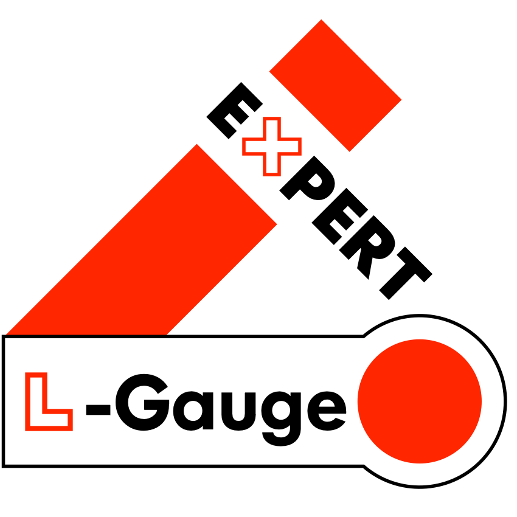
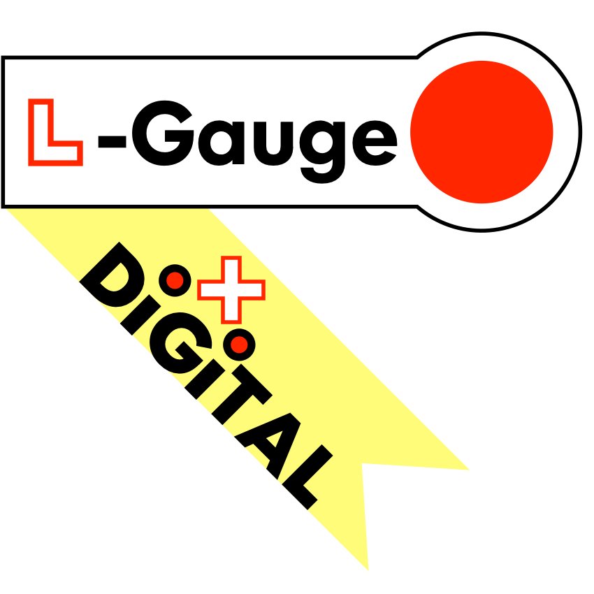
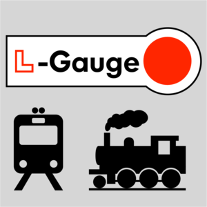
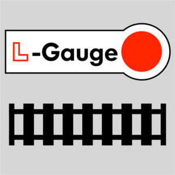
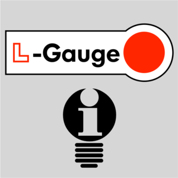
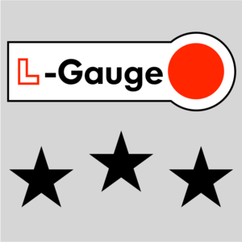

# L-Gauge.org Logos and Identity

This repository contains logos and graphic assets defining the L-Gauge visual identity. These graphic assets can be used freely to brand L-Gauge related documentation, online visuals, and other relevant applications.

## Official Logo

<table>
<tr>
  <td>Full Size Logo</td>
  <td></td>
  <td>Useful for title graphics and branding on colour backgrounds</td>
  <td>pdf, png, svg</td>
</tr>
<tr>
  <td>Regular Logotype</td>
  <td></td>
  <td>Useful for shortform title graphics or combining with other graphic elements</td>
  <td>pdf, png, svg</td>
</tr>
<tr>
  <td>Small Square Logo</td>
  <td></td>
  <td>Useful for avatar icons, small title graphics, bullets, or combining with other graphics</td>
  <td>pdf, png, svg</td>
</tr>
</table>

## Logo Variants

These variants of the L-Gauge logo are to brand alternate themes or ideas within the L-Gauge ecosystem.

<table>
<tr>
  <td>L-Gauge Expert</td>
  <td></td>
  <td>Used for branding expert or advanced ideas, concepts, instructions, etc.</td>
  <td>pdf, png, svg</td>
</tr>
<tr>
  <td>L-Gauge Digital</td>
  <td></td>
  <td>Used for branding LEGO® train control systems and electronics</td>
  <td>pdf, png, svg</td>
</tr>
</table>

## flickr "Lego Train MOCs" Groups

These logos have been contributed to the dominant flickr groups representing the LEGO® train hobby community. The LEGO® Train MOCs group (and its siblings) boast over 2000 members worldwide and was started in Nov 2006.

<table>
<tr>
  <td><a href="https://www.flickr.com/groups/1281622@N20/">LEGO Train MOCs - Trains</a></td>
  <td></td>
  <td>flickr group for trains and rolling stock MOCs</td>
  <td>png</td>
</tr>
<tr>
  <td><a href="https://www.flickr.com/groups/1281622@N20/">LEGO Train MOCs - Layouts</a></td>
  <td></td>
  <td>flickr group for showcasing layouts and dioramas</td>
  <td>png</td>
</tr>
<tr>
  <td><a href="https://www.flickr.com/groups/1353660@N21/">LEGO Train MOCs - Ideas</a></td>
  <td></td>
  <td>flickr group for interesting and novel ideas, concepts, building techniques, etc.</a></td>
  <td>png</td>
</tr>
<tr>
  <td><a href="https://www.flickr.com/groups/2752184@N21/">LEGO Train MOCs - Top Notch</a></td>
  <td></td>
  <td>flickr group showcasing the very best of LEGO® train building</td>
  <td>png</td>
</tr>
</table>

## Links

<li><a href="http://l-gauge.org/">L-Gauge.org</a></li>
<li><a href="http://brickmodelrailroader.com/">Brick Model Railroader</a></li>
<li><a href="http://www.eurobricks.com/forum/index.php?showforum=122">Eurobricks LEGO® Train Tech Forum</a></li>
